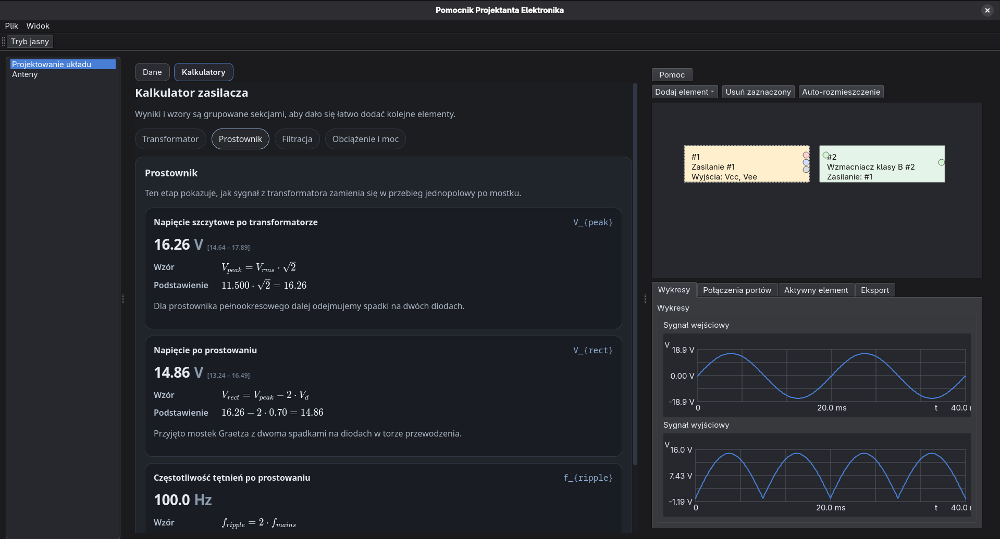

# Pomocnik Projektanta Elektronika

Desktopowa aplikacja `C++20` i `Qt`, której celem jest wspieranie projektowania prostych układów elektronicznych: od doboru parametrów i szybkich obliczeń, przez składanie bloków funkcjonalnych i eksport do `LTspice`.



## Co działa obecnie

- aplikacja desktopowa `ppe_gui` oparta o `Qt Widgets`
- aplikacja CLI `ppe`
- moduł projektowania blokowego układu z wizualizacją połączeń
- walidacja zgodności portów i podstawowych zależności między blokami
- kalkulacje i widoki pomocnicze dla wybranych modułów
- eksport do `LTspice`
- osobne warstwy dla `model`, `ui`, `export` i integracji `ltspice`
- zestaw testów jednostkowych i widgetowych uruchamianych w `ctest`

## Architektura

- `model/` zawiera reguły domenowe, dane i operacje na połączeniach
- `ui/` odpowiada za interakcję, formularze, scenę i prezentację
- `export/` składa dane projektu do formatu wyjściowego
- `ltspice/` przechowuje szczegóły techniczne integracji z LTspice


## Szybki start

```bash
cmake -S . -B build
cmake --build build
./build/ppe list
./build/ppe_gui
```

## CLI

```bash
ppe list
ppe run <module-id> [args...]
ppe ltspice-import <path>
```

## Testy i lokalna weryfikacja

```bash
cmake -S . -B build
cmake --build build
ctest --test-dir build --output-on-failure
```

Szybka weryfikacja przed zmianami:

```bash
./scripts/verify.sh
```

## Docker

Jeśli lokalnie nie ma skonfigurowanego środowiska `C++` i `Qt`, można użyć Dockera:

```bash
docker build -t ppe-dev .
docker run --rm -it ppe-dev
```

GUI na Linuksie (`X11`):

```bash
docker run --rm -it -e DISPLAY=$DISPLAY -v /tmp/.X11-unix:/tmp/.X11-unix ppe-dev
```

Szczegóły: `docs/DEV_DOCKER.md`

## Paczki i release

- paczkowanie działa dla Windows, Linux i macOS
- CI buduje i testuje projekt na wielu systemach
- workflow release tworzy paczki po oznaczeniu wersji tagiem

Przydatne skrypty:

- Windows: `scripts/package_windows.ps1`
- macOS: `scripts/package_macos.sh`
- Linux: `scripts/package_linux.sh`

Szczegóły: `docs/RELEASE.md`

## Narzędzia pomocnicze

- lokalne uruchamianie GUI na Wayland: `./scripts/run_gui.sh`
- generowanie ikon: `scripts/generate_icons.py`
- ikona macOS: `scripts/generate_icons_macos.sh`
- podpisywanie instalatorów:
  - Windows: `scripts/sign_windows.ps1`
  - macOS: `scripts/sign_macos.sh`

## Status

Projekt jest aktywnie rozwijany. Priorytetem jest poprawna logika, prosty podział na warstwy i możliwość dokładania nowych bloków funkcjonalnych bez zwiększania złożoności UI.
